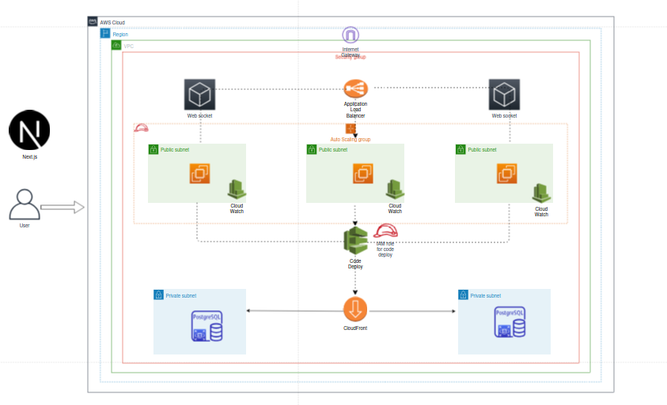

# Design-an-AWS-solution-for-deploying-a-chess-game-app-using-Next.js-
Design an AWS solution for deploying a chess game app using Next.js, NestJS, PostgreSQL, Redis, and WebSockets. Focus on scalability, cost efficiency, and security.

### Assignment :
### AWS Cloud Solution Design Assessment -

- Design an AWS solution for deploying a chess game app using Next.js, NestJS, PostgreSQL, Redis, and WebSockets. Focus on scalability, cost efficiency, and security.
- Areas to Address:
- Architecture Design: Propose AWS services like EC2/ECS for the backend, RDS for PostgreSQL, ElastiCache for Redis, and CloudFront for frontend. Explain WebSocket scaling.
- Scaling & Cost Efficiency: Plan for auto-scaling, WebSocket connection handling, and cost optimization with on-demand instances, CDN, and caching.
- Security: Outline security practices using IAM, VPC, Secrets Manager, and CloudWatch for monitoring.
- Database: Manage scaling of RDS.
- Scheduling: Redis task scheduling.
  

